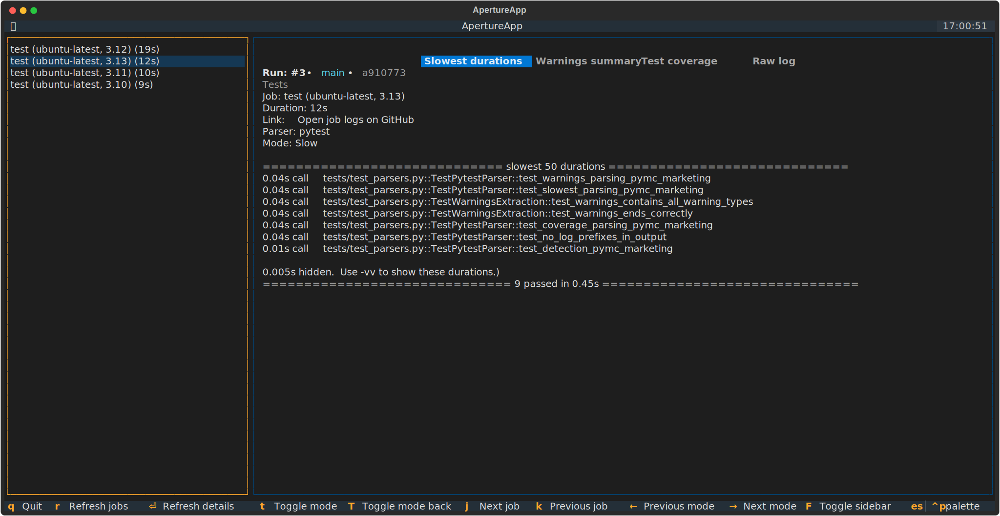

# Action Aperture 🔍

**Action Aperture** is a terminal-based UI (TUI) for inspecting and analyzing GitHub Actions logs. View test results, warnings, coverage reports, and raw logs in an intuitive, keyboard-driven interface.



## Features

- 📊 **Intelligent Log Parsing**: Automatically detects and parses different log formats
- 🧪 **Pytest Support**: Built-in parser for pytest logs with slowest tests, warnings, and coverage
- 🚀 **Fast Navigation**: Keyboard shortcuts for quick browsing through workflows, runs, and jobs
- 📋 **Copy to Clipboard**: Easily copy log sections for sharing or further analysis
- 🔌 **Extensible**: Plugin-based architecture for adding support for more log types
- 💻 **GitHub CLI Integration**: Uses `gh` CLI for seamless GitHub Actions access

## Installation

### Using uv (recommended)

```bash
uv tool install action-aperture
```

### From source

```bash
gh repo clone williambdean/action-aperture
cd action-aperture
uv tool install .
```

## Prerequisites

- Python 3.13+
- [GitHub CLI (`gh`)](https://cli.github.com/) installed and authenticated

## Usage

### Basic Usage

Launch the TUI in the current repository:

```bash
actap
```

Specify a repository:

```bash
actap owner/repo
```

### Advanced Options

Open a specific workflow run:

```bash
actap --run-id 123456789
actap --run-url https://github.com/owner/repo/actions/runs/123456789
```

Pre-select a specific job:

```bash
actap --run-id 123456789 --job-id 987654321
```

### Environment Variables

Set a default repository with the `APERTURE_REPO` environment variable:

```bash
export APERTURE_REPO=owner/repo
actap
```

## Keyboard Shortcuts

### Navigation
- `j`/`k` or `↑`/`↓`: Navigate jobs
- `←`/`→`: Switch between log sections
- `t`/`T`: Cycle through sections forward/backward
- `u`/`d`: Page up/down in logs
- `Enter`: Refresh current job

### Views
- `F`: Toggle fullscreen detail view
- `c`: Copy current log section to clipboard

### General
- `r`: Refresh jobs list
- `Esc`: Go back / Exit
- `q`: Quit application

## Supported Log Parsers

### Pytest (Built-in)
Automatically detects pytest test logs and extracts:
- **Slowest Tests**: Duration analysis for optimization
- **Warnings**: Summary of all warnings
- **Coverage**: Test coverage reports
- **Raw Logs**: Full unprocessed output

### Future Parsers
Action Aperture is designed to support multiple log formats. Planned additions include:
- ESLint/Prettier logs
- TypeScript compiler output
- Ruff/mypy linting results
- Release logs
- Custom workflow logs

## Contributing

We welcome contributions! To add a new log parser:

1. Create a new parser class in `src/aperture/parsers/`
2. Inherit from `LogParser` base class
3. Implement detection and parsing logic
4. Register in `src/aperture/parsers/__init__.py`

See `src/aperture/parsers/pytest.py` for a complete example.

## Development

### Setup

```bash
gh repo fork williambdean/action-aperture
cd action-aperture
uv sync
```

### Running from source

```bash
uv run python -m aperture.tui
```

### Linting

```bash
uvx ruff check .
uvx ruff format .
```

## License

MIT License - see LICENSE file for details.

## Credits

Built with [Textual](https://github.com/Textualize/textual) by [Will McGugan](https://github.com/willmcgugan).
